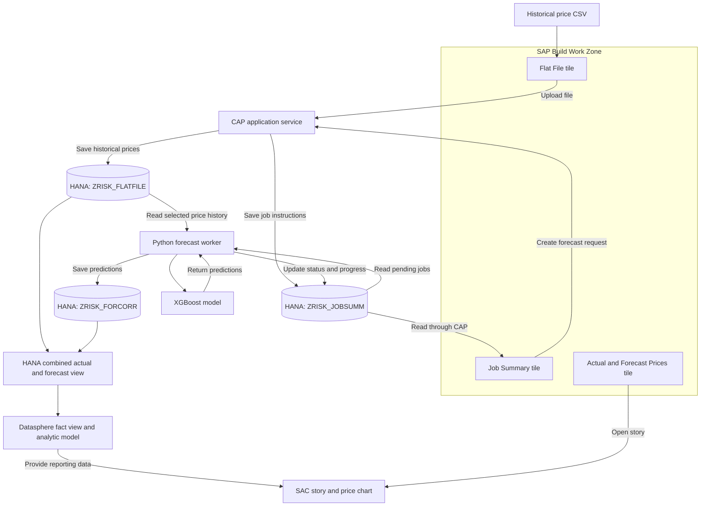

# SAP Time Series Forecasting – SAP HANA and Analytics

**Organization:** Aruma Tech  
**Platform:** SAP Business Technology Platform (SAP BTP)  
**Primary Languages:** Python and JavaScript  
**User Interface:** SAP Fiori applications in SAP Build Work Zone

## 1. Overview

This project provides an end-to-end workflow for uploading historical market prices, creating forecasting jobs, storing predictions in SAP HANA Cloud, and viewing actual and forecast prices in SAP Analytics Cloud.

Users access the solution through three tiles in SAP Build Work Zone:

- **Flat File** – upload and view historical price data.
- **Job Summary** – create forecasting jobs and view their progress.
- **Actual and Forecast Prices** – open the SAP Analytics Cloud dashboard.

Python performs the forecasting. SAP HANA stores the historical prices, job instructions and results. SAP Datasphere connects the stored data to the analytics dashboard.

The project also includes a scheduled Python process that collects external market data from EIA, FRED, Yahoo Finance and the World Bank.

## 2. System Architecture



**CAP** is the application's backend service. It handles requests from the screens and reads or writes HANA data. The Python forecast worker connects directly to HANA to read jobs and historical prices, save predictions and update job progress.

## 3. Implemented Functionality

- CSV upload into SAP HANA through the Flat File application.
- Instrument selection using DCSID and MIC.
- Forecast requests with a model, start date and horizon.
- Background processing of forecast jobs.
- XGBoost forecasting using historical instrument prices.
- Job status, completion percentage and execution timestamps.
- Forecast output linked to the job that produced it.
- A combined HANA view of actual and forecast prices.
- Datasphere integration and an SAC price-comparison dashboard.
- Work Zone tiles providing a common entry point.
- Historical and scheduled incremental collection of external market data.

## 4. Technology Stack

| Component | Technology | Role |
|---|---|---|
| Cloud platform | SAP BTP and Cloud Foundry | Hosts the application services |
| Development environment | SAP Business Application Studio | Develops, builds and deploys the project |
| User applications | SAP Fiori / SAPUI5 | Provides the upload and job screens |
| Application entry point | SAP Build Work Zone | Presents the three application tiles |
| Backend | SAP CAP with Node.js | Handles uploads, job creation and data access |
| Forecast service | Python, Flask and Gunicorn | Runs the application and background forecast worker |
| Forecast model | XGBoost | Generates predictions from price history |
| Data preparation | pandas | Prepares dates, prices and model inputs |
| Database connection | `hdbcli` | Connects Python to SAP HANA |
| Database | SAP HANA Cloud with an HDI container | Stores application tables and reporting views |
| Market-data requests | `requests` and `yfinance` | Retrieves external observations |
| Scheduling | SAP Job Scheduling Service | Starts recurring market-data updates |
| Reporting model | SAP Datasphere | Makes HANA data available for analytics |
| Dashboard | SAP Analytics Cloud (SAC) | Displays actual and forecast prices |
| Authentication | XSUAA and BTP role collections | Supports application sign-in and permissions |

## 5. Application Structure

The main application components are organized as follows. Generated build folders are omitted.

```text
TIME_SERIES_FORECAST/
|
├── app/
│   ├── flatfile/                    # Historical price upload application
│   └── jobsumm/                     # Job creation and status application
|
├── db/
│   ├── datamodel.cds                # Historical prices, jobs and results
│   ├── oil.cds                      # External market-data entities
│   ├── tbac.cds                     # Instrument reference definition
│   └── src/
│       └── ZRISK_ACTUAL_FORECAST.hdbcalculationview
|
├── srv/
│   ├── cat-service.cds              # Application service definitions
│   ├── cat-service.js               # CSV upload and job creation logic
│   └── oil-service.cds              # External market-data service
|
├── python/
│   ├── app.py                      # Forecast worker and application endpoints
│   ├── fetch_oil_data.py            # Historical market-data loader
│   ├── update_oil_data.py           # Incremental market-data updater
│   ├── models/
│   │   ├── flat_file_xgboost.py      # Instrument price forecasting
│   │   └── gulf_gasoline_xgboost.py  # Separate gasoline model
│   ├── requirements.txt
│   └── runtime.txt
|
├── mta.yaml                        # Application deployment configuration
├── xs-security.json                # Application scopes and roles
└── package.json                    # Dependencies and build commands
```

## 6. Historical Price Upload

The user uploads a CSV through the **Flat File** tile.

```text
Historical price CSV
        |
        v
Flat File application
        |
        v
CAP uploadCSV action
        |
        +--> Read columns and convert dates
        +--> Validate required identifiers
        +--> Attach the uploaded filename
        |
        v
SAP HANA: ZRISK_FLATFILE
```

CAP inserts new records and updates matching records using the price record's key fields.

| Field | Meaning |
|---|---|
| `DCSID` | Identifier for the price instrument |
| `MIC` | Market code associated with the instrument |
| `PRICETYPE` | Type of price observation |
| `MKEYDT` | Maturity key date |
| `PRICEDATE` | Date of the historical price |
| `PRICE` | Observed price |
| `PER` | Quantity basis for the price |
| `UOM` | Unit of measure |
| `CURRENCY` | Currency of the price |
| `FILENAME` | Uploaded source filename, recorded by the application |

The instrument selection lists combine DCSID/MIC pairs from uploaded prices and the `TBAC_DCS_MIC` reference table. Selecting a DCSID narrows the available MIC choices.

## 7. Forecast Job Creation

The user opens **Job Summary → New Job → Forecast** and enters:

- Model.
- DCSID and MIC.
- Job Start Date.
- Horizon type: day, week or month.
- Horizon value.

CAP assigns a Job ID and saves the request in `ZRISK_JOBSUMM` with status `ENTERED`.

The **Job Start Date** is the first date to forecast. The **Job Start Timestamp** records when processing actually begins. Creating a job does not fill the execution-start timestamp.

Jobs run in the background, so the user can leave the screen after submitting a request.

## 8. Python Forecast Processing

```text
Read an ENTERED forecast job from ZRISK_JOBSUMM
        |
        v
Set status to RUNNING and record the start timestamp
        |
        v
Read historical prices from ZRISK_FLATFILE
        |
        v
Select the job's DCSID / MIC and prices before Job Start Date
        |
        v
Run the forecasting model
        |
        v
Save predictions in ZRISK_FORCORR
        |
        v
Set status to COMPLETED, completion to 100%, and record end time
```

The worker updates the completion percentage during processing. If processing raises an error, the error handler records a `FAILED` status.

### XGBoost model

The flat-file model learns from the selected instrument's historical prices using two inputs:

- The price **one observation earlier**.
- The price **seven observations earlier**.

It predicts the next value, adds that prediction to the working history and repeats for the requested horizon. These are observation-based lags; their calendar spacing follows the available historical records.

The job workflow produces daily output:

| Horizon selection | Output |
|---|---|
| 7 days | 7 daily forecast rows |
| 1 week | 7 daily forecast rows |
| 1 month | 30 daily forecast rows |

For example, a seven-day forecast starting September 16 produces predictions dated September 16 through September 22.

### HANA APL integration code

A separate `flat_file_hana_apl.py` adapter has been prepared for the HANA APL model option. It stages the selected price history in a dedicated HANA workspace and calls `AutoTimeSeries` through `hana-ml`. It returns dated predictions in the format used by the forecast worker.

This describes the prepared integration code. The demonstrated execution flow in this README uses XGBoost.

## 9. SAP HANA Tables and Results

| Table or view | Purpose |
|---|---|
| `ZRISK_FLATFILE` | Historical prices uploaded by users |
| `ZRISK_JOBSUMM` | Job parameters, status, progress and execution timestamps |
| `ZRISK_FORCORR` | Forecast output associated with a Job ID |
| `TBAC_DCS_MIC` | Reference instrument pairs for selection lists |
| `ZRISK_ACTUAL_FORECAST` | Calculation view combining actual and forecast prices |
| `ZFOR_*` | External market observations collected by Python |

Each forecast row contains the instrument identifiers, forecast date, predicted price and Job ID. Price type, maturity date, quantity basis, currency and unit are copied from the latest eligible historical record for the selected instrument.

```text
ZRISK_JOBSUMM
    |
    | JOB_ID
    |
    +--> ZRISK_FORCORR: forecast for day 1
    +--> ZRISK_FORCORR: forecast for day 2
    +--> ZRISK_FORCORR: forecast for day 3
    +--> ...
```

This relationship connects each prediction to the request that produced it.

## 10. External Market Data Collection

The project collects shared market histories through two Python scripts:

| Script | Purpose |
|---|---|
| `fetch_oil_data.py` | Loads historical market observations |
| `update_oil_data.py` | Retrieves and saves recent updates |

```text
EIA / FRED / Yahoo Finance / World Bank
        |
        v
Python collection script
        |
        +--> Retrieve observations
        +--> Standardize dates and columns
        |
        v
CAP OilService
        |
        v
SAP HANA: ZFOR tables
```

| Provider | Data collected | CAP entities |
|---|---|---|
| EIA | Energy prices, inventories, refinery utilization and trade flows | `EIA_PRICES_DAILY`, `EIA_INVENTORY_WEEKLY`, `EIA_REFINERY_UTIL_WEEKLY`, `EIA_IMPORTS_EXPORTS_WEEKLY` |
| FRED | Currency indicators, price indexes and interest rates | `FRED_CURRENCY_DAILY`, `FRED_INFLATION_MONTHLY` |
| Yahoo Finance | Historical futures prices and a dollar index | `YAHOO_FUTURES_DAILY` |
| World Bank | Annual economic growth and inflation | `WORLDBANK_MACRO_ANNUAL` |

The scheduled collection path stores these external observations. The instrument-level XGBoost job described above reads the uploaded history in `ZRISK_FLATFILE`.

## 11. Daily Scheduled Updates

SAP Job Scheduling Service runs the **OilDataFetcher** job as a Cloud Foundry task against the deployed Python application.

```text
SAP Job Scheduling Service
        |
        v
Cloud Foundry task: TIME_SERIES_FORECAST-python
        |
        v
python update_oil_data.py
        |
        v
Read latest stored dates and fetch recent observations
        |
        v
CAP OilService → HANA ZFOR tables
```

The configured morning schedule used **13:00 UTC**, corresponding to **8:00 a.m. Chicago time during daylight saving time**. The schedule options supplied a **4 GB task disk allocation**.

The updater reads the latest stored period for each dataset, fetches recent data with an overlap window and writes updates through CAP. Execution results are available in the scheduler and Cloud Foundry task logs.

The scheduled updater and the background forecast worker perform different tasks: one refreshes external market data, while the other processes user-created forecast jobs.

## 12. Datasphere and SAP Analytics Cloud

The reporting flow is:

```text
ZRISK_FLATFILE                  ZRISK_FORCORR
Historical actual prices       Generated forecast prices
        |                              |
        +---------------+--------------+
                        |
                        v
             ZRISK_ACTUAL_FORECAST
             HANA calculation view
                        |
                        v
             Datasphere remote table
                        |
                        v
                   Fact view
                        |
                        v
                 Analytic model
                        |
                        v
                   SAC story
                        |
                        v
           Actual and forecast price chart
```

The calculation view combines actual and forecast records. A `TYPE` field distinguishes the two so they remain separate series in the chart.

Datasphere provides the reporting model, including the price measure and fields used for filtering. SAC uses that model to display prices over time. Users can select a date range and inspect chart values.

The **Actual and Forecast Prices** Work Zone tile opens the SAC story in a new tab.

## 13. Hosting and Application Access

The deployment configuration in `mta.yaml` packages the application components together:

| Component | Deployment location |
|---|---|
| Flat File and Job Summary applications | HTML5 Application Repository |
| CAP backend | Cloud Foundry application `TIME_SERIES_FORECAST-srv` |
| Python service and forecast worker | Cloud Foundry application `TIME_SERIES_FORECAST-python` |
| Database tables and views | HANA HDI container `TIME_SERIES_FORECAST-db` |

An **HDI container** is the application's managed database area. Service bindings provide the database and service connection details to the running applications. BTP destinations provide configured routes to the backend and external services.

Access is handled at the relevant application layer:

- Work Zone roles determine access to the site and tiles.
- XSUAA supports application authentication.
- CAP permissions control reading prices, uploading files and creating jobs.
- SAC and Datasphere permissions control access to the story and reporting data.

Credentials are supplied through environment configuration, service bindings and destinations rather than included in this README.

## 14. Build and Deployment Commands

Run these commands from the application project root in the configured SAP development environment.

### Build the application

```bash
npm run build
```

This creates the deployment archive using the project's MTA build configuration.

### Deploy the application

```bash
npm run deploy
```

This deploys `mta_archives/archive.mtar` to the currently targeted Cloud Foundry organization and space.

### Run CAP against the configured HANA binding

```bash
cds watch --profile hybrid
```

This uses the project's local hybrid service binding.

### Inspect deployed application logs

```bash
cf logs TIME_SERIES_FORECAST-srv --recent
cf logs TIME_SERIES_FORECAST-python --recent
```

Work Zone content, scheduler jobs, Datasphere models and the SAC story are configured in their respective services in addition to the application deployment.

## 15. End-to-End User Workflow

1. Open the **Time Series Forecasting** Work Zone site.
2. Open **Flat File** and upload historical prices.
3. Check the uploaded records and instrument identifiers.
4. Open **Job Summary** and create a forecast request.
5. Select the model, instrument, start date and horizon.
6. Submit the request and follow its status in Job Summary.
7. Python reads the job, generates predictions and saves the results in HANA.
8. Open **Actual and Forecast Prices** to view the SAC story.
9. Select the relevant instrument and date range to compare actual and forecast prices.

## 16. Component Reference

| File or component | What it does |
|---|---|
| `app/flatfile` | Provides the historical price upload and viewing screen |
| `app/jobsumm` | Provides instrument selection, job creation and status viewing |
| `srv/cat-service.js` | Validates uploads, saves price rows and initializes job records |
| `srv/cat-service.cds` | Exposes application data and actions through CAP |
| `srv/oil-service.cds` | Exposes the external market-data entities |
| `python/app.py` | Reads pending forecast jobs, invokes a model, saves results and updates progress |
| `python/models/flat_file_xgboost.py` | Prepares instrument history and produces XGBoost forecasts |
| `python/models/gulf_gasoline_xgboost.py` | Contains the separate gasoline forecasting model using gasoline and WTI history |
| `python/fetch_oil_data.py` | Retrieves historical external market data |
| `python/update_oil_data.py` | Refreshes recently published market observations |
| `db/datamodel.cds` | Defines historical prices, job records and forecast output |
| `db/oil.cds` | Defines the external market-data storage entities |
| `ZRISK_ACTUAL_FORECAST` | Presents historical and forecast prices together for reporting |
| `mta.yaml` | Defines application modules, service bindings and deployment settings |
| `xs-security.json` | Defines application security scopes and roles |
